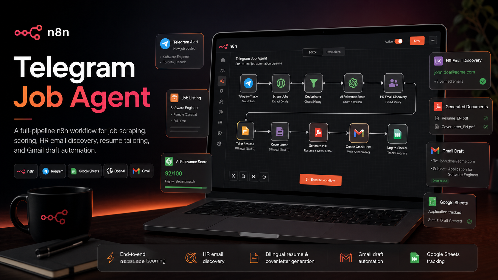
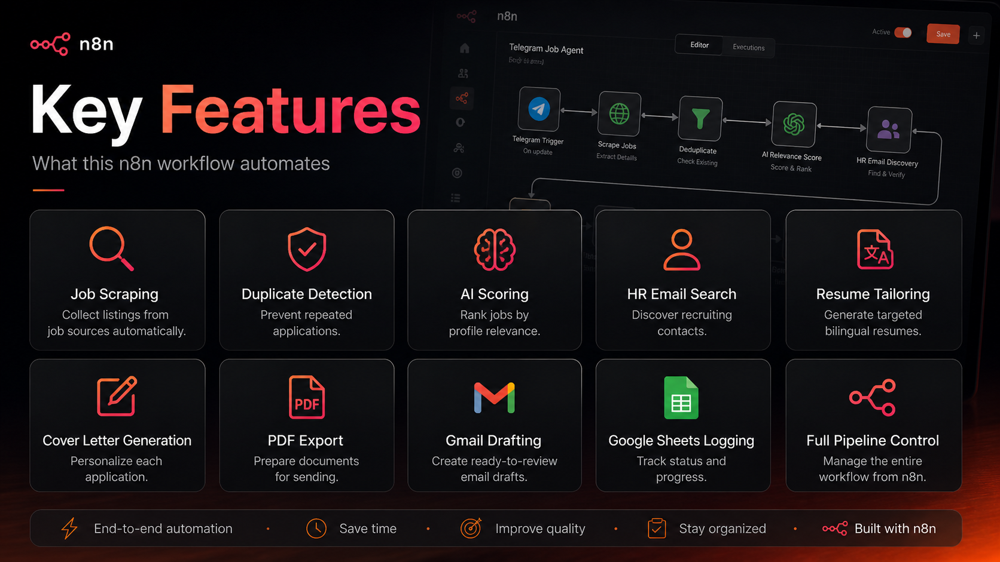
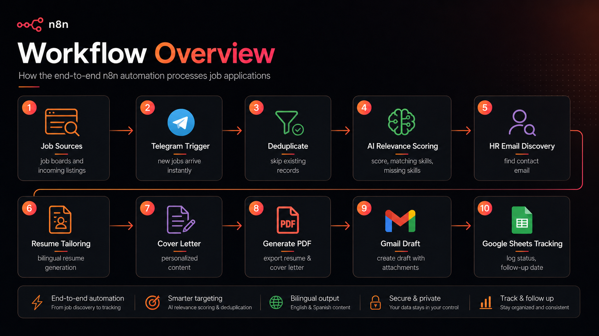
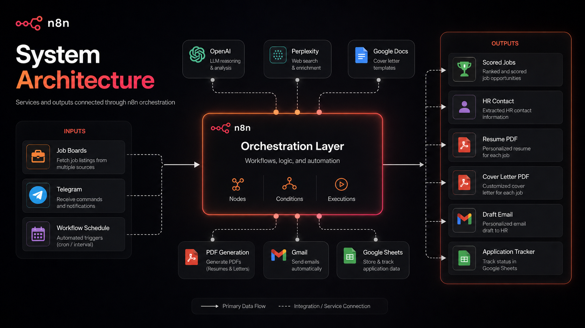

# Telegram Job Agent - n8n Automation Pipeline

<p align="center">
  
</p>

<p align="center">
  <strong>An end-to-end n8n workflow for job discovery, relevance scoring, HR email discovery, resume tailoring, cover-letter generation, Gmail draft creation, and Google Sheets tracking.</strong>
</p>

<p align="center">
  <a href="#-overview">Overview</a> •
  <a href="#-features">Features</a> •
  <a href="#-workflow">Workflow</a> •
  <a href="#-architecture">Architecture</a> •
  <a href="#-folder-structure">Folder Structure</a> •
  <a href="#-setup">Setup</a>
</p>

<p align="center">
  
  
  
  
  
</p>

---

## 🚀 Overview

**Telegram Job Agent** is a professional n8n automation workflow designed to streamline the job application process from discovery to follow-up tracking.

Instead of manually checking job boards, filtering listings, writing custom application documents, searching for HR contacts, and drafting emails, this workflow brings those steps into one automated pipeline.

It can:

- collect job listings,
- remove duplicate records,
- evaluate job relevance using AI,
- find HR or recruiting contact emails,
- generate personalized resumes and cover letters,
- export application documents as PDFs,
- create Gmail drafts with attachments,
- and track everything inside Google Sheets.

This project is ideal for showcasing advanced n8n orchestration, AI-assisted automation, and practical productivity workflows.

---

## ✨ Features

<p align="center">
  
</p>

### Core capabilities

| Feature | Description |
|---|---|
| **Job scraping / ingestion** | Collects job opportunities from configured sources and stores structured job data. |
| **Duplicate detection** | Prevents repeated applications by checking existing records before appending new jobs. |
| **AI relevance scoring** | Scores each job based on profile fit, matching skills, and missing skills. |
| **HR email discovery** | Attempts to find HR, recruiting, careers, or talent-acquisition email contacts. |
| **Resume tailoring** | Generates targeted resume content based on each job description. |
| **Cover-letter generation** | Creates personalized cover-letter paragraphs for each role. |
| **PDF generation** | Exports resume and cover-letter documents into application-ready PDFs. |
| **Gmail draft creation** | Creates ready-to-review Gmail drafts with generated documents attached. |
| **Google Sheets tracking** | Logs job details, scores, contact information, status, and follow-up fields. |
| **Full pipeline control** | Centralized automation logic using n8n nodes, conditions, schedules, and integrations. |

---

## 🔁 Workflow

<p align="center">
  
</p>

The workflow follows a structured automation sequence:

1. **Job sources are checked**  
   New job listings are collected from the configured job source or scraping flow.

2. **Telegram trigger or scheduled execution starts the pipeline**  
   The workflow can be triggered through Telegram updates or a scheduled n8n trigger.

3. **Duplicate records are removed**  
   Existing jobs are checked against stored records so the workflow does not process the same job repeatedly.

4. **AI evaluates job relevance**  
   Each job is scored based on relevance to the target profile, matching skills, and missing skills.

5. **HR contact discovery runs**  
   The workflow tries to extract or discover an HR/recruiting email from the job post or company context.

6. **Resume content is tailored**  
   The resume is adapted based on job requirements, language, and role context.

7. **Cover letter is generated**  
   The workflow creates personalized application text with structured paragraphs.

8. **Application PDFs are created**  
   Resume and cover-letter outputs are converted into PDF files.

9. **Gmail draft is prepared**  
   A draft email is created with the application content and documents attached.

10. **Google Sheets is updated**  
   Job status, scores, generated files, contact information, and application progress are tracked.

---

## 🏗️ Architecture

<p align="center">
  
</p>

The project uses **n8n as the orchestration layer** and connects multiple services into one application pipeline.

### Main components

| Component | Role |
|---|---|
| **n8n** | Main workflow engine and orchestration layer. |
| **Telegram** | Trigger source and notification/command interface. |
| **Google Sheets** | Application database and tracking table. |
| **OpenAI** | AI relevance scoring, reasoning, resume tailoring, and content generation. |
| **Perplexity** | Web-based HR email discovery and enrichment. |
| **Google Docs** | Resume and cover-letter template source. |
| **Gotenberg / PDF service** | HTML-to-PDF conversion for generated documents. |
| **Gmail** | Draft email creation with generated attachments. |

---

## 🧠 Why this project is useful

Job applications often involve repeated, manual, and error-prone steps:

- finding relevant jobs,
- checking whether a role is worth applying to,
- adapting a resume,
- writing a cover letter,
- finding the right contact email,
- preparing files,
- drafting an email,
- and tracking the application.

This project turns that process into a repeatable automation pipeline.

It does not blindly send applications. Instead, it prepares structured outputs such as relevance scores, personalized documents, and Gmail drafts so the user can review before sending.

---

## 📂 Folder Structure

Your repository can be organized like this:

```txt
main/
├── images/
│   ├── hero.png
│   ├── workflow-overview.png
│   ├── key-features.png
│   └── system-architecture.png
├── README.md
└── telegram-job-agent-workflow.json
```

### File descriptions

| File | Purpose |
|---|---|
| `README.md` | Main GitHub documentation for the project. |
| `images/hero.png` | README hero banner. |
| `images/workflow-overview.png` | Visual explanation of the pipeline. |
| `images/key-features.png` | Feature-grid image for the project. |
| `images/system-architecture.png` | System architecture diagram. |
| `telegram-job-agent-workflow.json` | Exported n8n workflow file. |

---

## ⚙️ Setup

### 1. Clone the repository

```bash
git clone https://github.com/YOUR_USERNAME/n8n-telegram-job-agent.git
cd n8n-telegram-job-agent
```

### 2. Import the workflow into n8n

1. Open your n8n instance.
2. Go to **Workflows**.
3. Click **Import from File**.
4. Select:

```txt
telegram-job-agent-workflow.json
```

5. Save the workflow.

### 3. Configure credentials

You will need to connect the credentials used by your workflow.

Typical credentials include:

- Google Sheets OAuth2
- Google Docs OAuth2
- Google Drive OAuth2
- Gmail OAuth2
- OpenAI API
- Perplexity API
- Telegram Bot API
- Apify API, if using an Apify-based scraping source
- Any PDF generation service used by your environment

> Do not commit real API keys, access tokens, OAuth secrets, private spreadsheet IDs, or personal email addresses to a public repository.

### 4. Update environment-specific values

Before running the workflow, review all nodes that contain:

- spreadsheet IDs,
- document IDs,
- folder IDs,
- file paths,
- webhook URLs,
- API endpoints,
- email addresses,
- local service URLs,
- template references,
- and language/profile-specific instructions.

Replace private values with your own configuration.

### 5. Test the workflow

Start with a small test run:

1. Disable email sending if enabled.
2. Run the workflow manually.
3. Confirm that job data is written to Google Sheets.
4. Confirm that scoring output looks correct.
5. Confirm generated documents are valid.
6. Confirm Gmail drafts are created correctly.
7. Review logs and fix missing credentials or mapping errors.

---

## 🔐 Security Notes

If you publish this project on GitHub, make sure to remove or anonymize:

- real Google Sheet IDs,
- Google Doc IDs,
- Google Drive file IDs,
- Gmail account references,
- API credentials,
- personal resume content,
- private email addresses,
- private company/contact data,
- internal webhook URLs,
- local server URLs,
- and any user-specific profile data.

Recommended practice:

```bash
git update-index --assume-unchanged telegram-job-agent-workflow.json
```

Or create a sanitized version:

```txt
telegram-job-agent-workflow.example.json
```

Use placeholders such as:

```txt
YOUR_GOOGLE_SHEET_ID
YOUR_GOOGLE_DOC_ID
YOUR_TELEGRAM_BOT_TOKEN
YOUR_OPENAI_CREDENTIAL
YOUR_GMAIL_CREDENTIAL
```

---

## 🧩 Suggested GitHub Repository Name

Recommended:

```txt
n8n-telegram-job-agent
```

Alternative names:

```txt
telegram-job-agent
job-application-automation-n8n
n8n-job-application-agent
job-hunt-automation-n8n
telegram-career-agent
```

---

## 🛠️ Tech Stack

| Tool | Usage |
|---|---|
| **n8n** | Workflow automation and orchestration |
| **Telegram** | Triggering and notifications |
| **Google Sheets** | Job tracking and application database |
| **Google Docs** | Resume and cover-letter templates |
| **Google Drive** | File storage |
| **Gmail** | Draft email creation |
| **OpenAI** | AI scoring and generated text |
| **Perplexity** | HR email discovery |
| **Gotenberg** | PDF generation |
| **Apify** | Job scraping / data collection |

---

## 📌 Example Use Case

A new software engineering job is discovered.

The workflow:

1. stores the job in Google Sheets,
2. checks that it is not a duplicate,
3. scores the job against the candidate profile,
4. identifies matching and missing skills,
5. searches for a relevant HR email,
6. generates a tailored resume,
7. creates a personalized cover letter,
8. exports both documents as PDFs,
9. creates a Gmail draft,
10. and updates the tracking sheet.

The user can then review the draft and decide whether to send it.

---

## 📈 Future Improvements

Possible enhancements:

- Add LinkedIn job source support.
- Add automatic follow-up reminders.
- Add interview-stage tracking.
- Add dashboard analytics for applications.
- Add automatic rejection detection from email replies.
- Add multi-profile support for different job targets.
- Add safer human approval checkpoints before draft generation.
- Add a sanitized example workflow for public sharing.

---

## 🧪 Recommended README Images

The images in this repository are designed to make the project look polished and professional:

```md


```

---

## ⚠️ Disclaimer

This project is intended as an automation assistant for organizing and preparing job applications. Always review generated emails, resumes, cover letters, and contact information before using them.

Do not use automation to spam recruiters, violate job platform terms, or submit applications without proper review.

---

## 📄 License

You can use this project under the MIT License.

```txt
MIT License
```

---

## 🙌 Credits

Built with ❤️ using **n8n** and modern AI automation tools.
